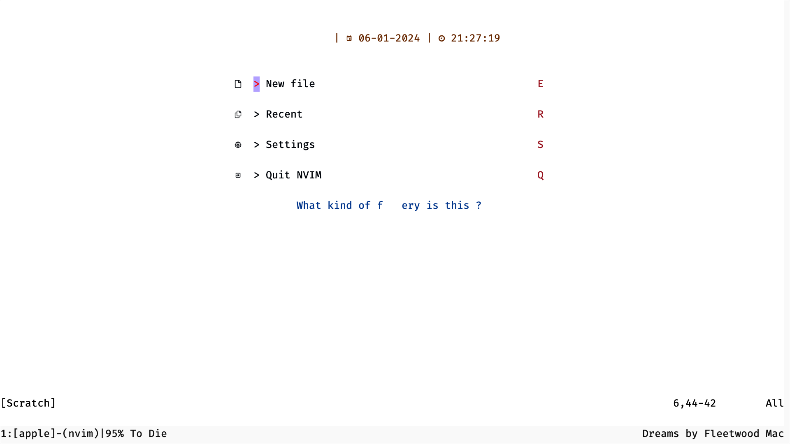
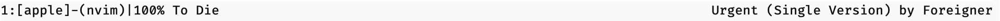
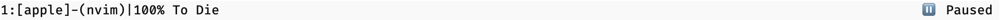
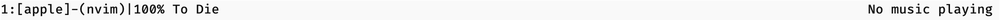

# tmux-apple-music

- ### This is a "code" that shows music status form **_Apple Music_** on Tmux status line
- ### **This is not a fully finished project**
- ### Tested only on Mac

* ### Made in Lua with apple script (osascript)

## Usage

- **Start a tmux session**
- The first step is import so that you can kill the session if you're unable to terminate the process
- Clone this repo using

```bash
    git clone <repo link>
```

- Test the file if it's working by running

```bash
    lua update_tmux_music.lua
```

**\*Warning: This overwrites your tmux config of status right\***

- If this works terminate the process by `Ctrl+C` till it is terminated
- If the process is still runnig you have to kill the current tmux session and start a new one (Working on it)
- Now if you'd like to make it default make it a executable by running

```bash
    chmod +x update_tmux_music.lua
```

- Now make it run in the background by running

```bash
    nohup ./update_tmux_music.lua > /dev/null 2>&1 &
```

- This will probably throw an error but don't mind it (Working on it)

- Now something like this should be visible at status-right



## Working

- The default configuration returns the current song and the artist



- The Status refreshes for every 10 seconds

- The Status shows `Paused` while paused



- `No Music Playing` will be shown when the app is closed



## Configuration

### To do before Starting Config

- **Before Configuration you must kill the runnig process you can use `kill` command with the PID**

- **In Mac use the following command in terminal to find the PID and kill the process**

```bash
kill lua
```

- **This returns the PID of the runnig lua process so make sure no other lua process are runing in the background**

### To Change application

- **You can use other applications like Spotify as it has the same state as Apple Music**
- To do it you have to change the application in `local command` to

```lua
local command = "osascript -e 'tell application \"Spotify\"' "
		.. "-e 'if it is running then' "
		.. "-e 'if player state is playing then' "
		.. "-e 'set currentTrack to name of current track' "
		.. "-e 'set currentArtist to artist of current track' "
		.. "-e 'set durationInSeconds to duration of current track' "
		.. "-e 'set currentPos to player position' "
		.. "-e 'return currentTrack & \" by \" & currentArtist ' "
		.. "-e 'else' "
		.. "-e 'return \"⏸️  Paused\"  ' "
		.. "-e 'end if' "
		.. "-e 'else' "
		.. "-e 'return \"No music playing\"' "
		.. "-e 'end if' "
		.. "-e 'end tell' "
```

### Config Options

- To display the current album with the song and artist change `local command` in `update_tmux_music.lua` to

```lua
local command = "osascript -e 'tell application \"Music\"' "
		.. "-e 'if it is running then' "
		.. "-e 'set currentTrack to name of current track' "
		.. "-e 'set currentArtist to artist of current track' "
		.. "-e 'set currentAlbum to album of current track' "
		.. "-e 'set durationInSeconds to duration of current track' "
		.. "-e 'set currentPos to player position' "
		.. "-e 'return currentTrack & \" from \" & currentAlbum & \" by \" & currentArtist ' "
		.. "-e 'else' "
		.. "-e 'return \"No music playing\"' "
		.. "-e 'end if' "
		.. "-e 'end tell' "
```

- To display the music status in `current position : total duration` format change `local command` in `update_tmux_music.lua` to

```lua
local command = "osascript -e 'tell application \"Music\"' "
		.. "-e 'if it is running then' "
		.. "-e 'set currentTrack to name of current track' "
		.. "-e 'set currentArtist to artist of current track' "
		.. "-e 'set currentAlbum to album of current track' "
		.. "-e 'set durationInSeconds to duration of current track' "
		.. "-e 'set currentPos to player position' "
		.. "-e 'return currentTrack & \" from \" & currentAlbum & \" by \" & currentArtist & \" | \" & currentPos div 60 & \" : \" & (round (currentPos mod 60)) & \" : \" & durationInSeconds div 60 & \" : \" & (round (durationInSeconds mod 60))t ' "
		.. "-e 'else' "
		.. "-e 'return \"No music playing\"' "
		.. "-e 'end if' "
		.. "-e 'end tell' "
```

- To change the refresh rate to lesser than 10 seconds replace 10 in `os.execute("sleep 10")` in `update_tmux_music.lua` to any value `>=1`

  > Note : Lesser the number the more processing it takes

- To display the time next to the music status change `local tmuxCommand` in `update_tmux_music.lua` to

```lua
    local tmuxCommand = 'tmux set-option -g status-right "' .. trackInfo .. '| %H:%M %d-%b-%y"'

```

### After Config

- Since we kill the process before starting we must re-start it after configuration
- Simply repeat the steps in Usage except `git clone`
