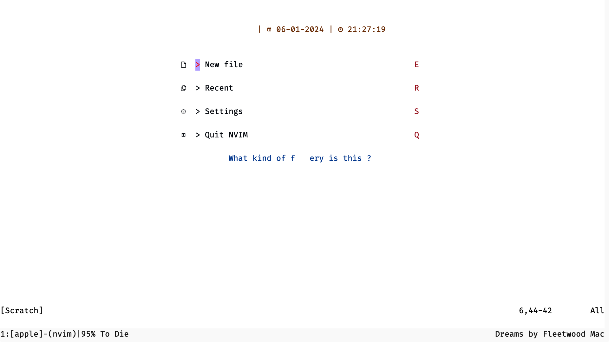

# tmux-apple-music

### **This is not a fully finished project**

## Usage

- **Start a tmux session**
- The first step is import so that you can kill the session if you're unable to terminate the process
- Clone this repo using

```bash
    git clone <repo link>
```

- Test the file if it's working by running

```bash
    lua update_tmux_music.lua
```

**\*Warning: This overwrites your tmux config of status right\***

- If this works terminate the process by `Ctrl+C` till it is terminated
- If the process is still runnig you have to kill the current tmux session and start a new one (Working on it)
- Now if you'd like to make it default make it a executable by running

```bash
    chmod +x update_tmux_music.lua
```

- Now make it run in the background by running

```bash
    nohup ./update_tmux_music.lua > /dev/null 2>&1 &
```

- This will probably throw an error but don't mind it (Working on it)

- Now the current music should be visible at status-right

  
